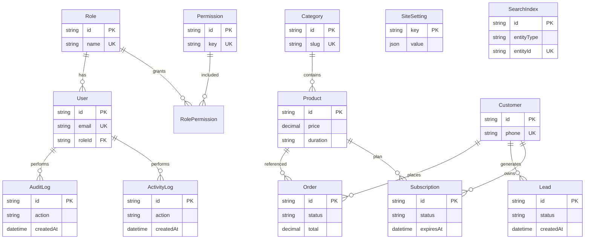

# SANAD IPTV — Phase 1 Implementation

## Objectives delivered

| # | Objective | Status |
|---|-----------|--------|
| 1 | Replace JSON storage with PostgreSQL (orders, products, audit, search, dashboard) | Done |
| 2 | DB schemas (12 entities) | Done — `frontend/prisma/schema.prisma` |
| 3 | Admin Orders CRUD | Done — list + detail + PATCH API |
| 4 | Product Management CRUD | Done — create/edit/delete via API + forms |
| 5 | Overview Dashboard (8 widgets) | Done — `/admin` |
| 6 | Command Palette (Ctrl+K) | Done |
| 7 | Global Search Index | Done — `SearchIndex` table + `/api/admin/search` |
| 8 | Append-only Audit Logs | Done — `AuditLog` + hooks on mutations |
| 9 | RBAC middleware | Done — `manager` role + route guards |
| 10 | Remove mock data from dashboard | Done |

## ERD



## Migration strategy

### Phase A — Infrastructure
1. Set `DATABASE_URL` (Neon / Supabase / Vercel Postgres).
2. `cd frontend && npm install`
3. `npm run db:migrate` — applies Prisma migrations.
4. `npm run db:seed` — roles, permissions, categories, default IPTV products, search index.

### Phase B — Data import (one-time)
```bash
npm run db:migrate-json   # imports data/*.json + iptv-products.json
npm run db:reindex-search # rebuilds SearchIndex
```

### Phase C — Cutover
| Before | After |
|--------|-------|
| `data/subscription-orders.json` | `Order` table via `createSubscriptionOrder()` |
| Extension `iptv-products.json` | `Product` table via `/api/admin/products` |
| In-memory audit | `AuditLog` + `ActivityLog` tables |
| Mock dashboard products | `getDashboardOverview()` |

### Remaining JSON (Phase 2)
- CMS content (`store-content.json`)
- Analytics events (`analytics-events.json`)
- Extension state / marketplace

## Setup commands

```bash
cd frontend
cp .env.example .env
# Edit DATABASE_URL

npm run db:migrate
npm run db:seed
npm run dev
```

## Key files

| Area | Path |
|------|------|
| Schema | `frontend/prisma/schema.prisma` |
| Prisma client | `frontend/src/lib/db/prisma.ts` |
| Orders | `frontend/src/lib/db/orders.ts` |
| Products | `frontend/src/lib/db/products.ts` |
| Dashboard | `frontend/src/lib/db/dashboard.ts` |
| Search | `frontend/src/lib/db/search.ts` |
| Audit | `frontend/src/lib/db/audit.ts` |
| RBAC | `frontend/src/lib/admin/rbac.ts` + `middleware.ts` |
| Command palette | `frontend/src/components/admin/CommandPalette.tsx` |

## RBAC roles

- **super_admin** — full access
- **admin** — commerce + CMS + settings
- **manager** — products, orders, leads, analytics
- **support** — read-only orders/leads/logs

Test manager login: `manager@sanad.iptv` / env `ADMIN_MANAGER_CODE` (default `sanad-manager`).

## Notes

- Prisma 7 uses `@prisma/adapter-pg` + `pg` driver.
- Admin routes use `dynamic = "force-dynamic"` — no DB access at build time.
- shadcn/ui: admin uses existing design system + `cmdk`; `@tanstack/react-table` is installed for future table upgrades.
- Storefront order POST: `/api/subscription-orders` writes to PostgreSQL.
