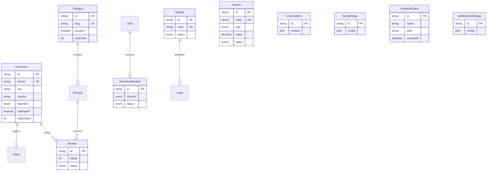

# SANAD IPTV — Phase 1.5: Complete Database Migration

## ERD (new / extended models)

## Database changes

| Model | Action |
|-------|--------|
| Customer | Add city, country, segment, notes, totalOrders, totalSpent |
| Category | Add description, isActive, sortOrder |
| Coupon | **New** |
| Review | **New** |
| AdminNotification | **New** |
| NotificationSettings | **New** (singleton) |
| Affiliate | **New** |
| CmsContent | **New** (singleton `storefront`) |
| SeoSettings | **New** (singleton `default`) |
| AnalyticsEvent | **New** |
| SiteSetting | Use for key-value site config (existing) |

## API design

| Resource | Endpoints | Permission |
|----------|-----------|------------|
| Customers | GET/POST `/api/admin/customers`, GET/PATCH/DELETE `[id]`, POST `bulk` | customers:* |
| Categories | GET/POST, GET/PATCH/DELETE `[id]` | categories:* |
| Coupons | GET/POST, GET/PATCH/DELETE `[id]`, POST `bulk` | coupons:* |
| Reviews | GET/POST, PATCH/DELETE `[id]`, POST `bulk` | reviews:* |
| Notifications | GET/POST, PATCH `[id]`, GET/PUT `settings` | notifications:* |
| Affiliates | GET/POST, GET/PATCH/DELETE `[id]` | affiliate:* |
| Roles | GET `/api/admin/roles` | users:read |
| SEO | GET/PUT `/api/admin/seo` | settings:write |
| Analytics | existing + DB-backed events | analytics:read |

Query params: `page`, `limit`, `search`, `status`, `sort`

## UI screens

| Page | Pattern |
|------|---------|
| Customers | Paginated table + profile detail |
| Categories | Split form + table with edit/delete |
| Coupons | Create form + table + bulk deactivate |
| Reviews | Table + approve/reject/delete bulk |
| Notifications | Inbox list + settings panels |
| Roles | DB roles table + permission summary |
| SEO | Editable meta defaults + route list |
| Affiliates | Partner CRUD table |
| Analytics | Unchanged layout, PostgreSQL events |

## Migration plan

1. `npm run db:migrate` — apply schema
2. `npm run db:seed` — sample coupons, reviews, affiliates
3. `npm run db:migrate-json` — import JSON files → Postgres
4. `npm run db:reindex-search`
5. Verify 0 mock imports from `data.ts` arrays
