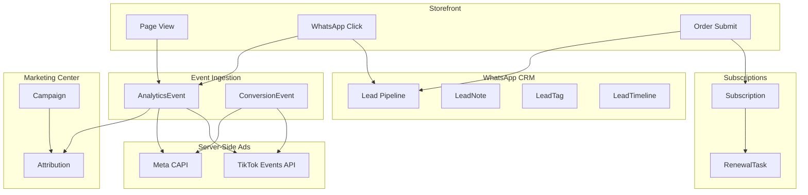
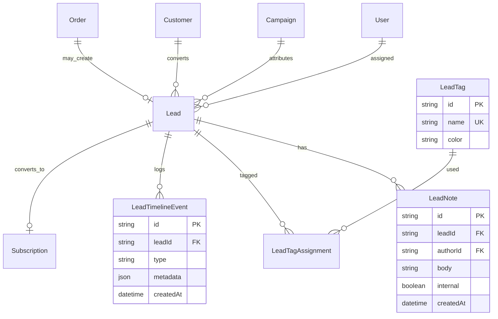

# SANAD IPTV — Phase 2 Implementation Plan

**Priority order:** WhatsApp CRM → Subscriptions → Renewals → Marketing Center → Meta CAPI → TikTok Events API → Funnel Analytics

**Prerequisite:** Phase 1 + 1.5 complete (PostgreSQL, orders, products, customers, analytics events, RBAC, audit logs).

---

## 1. Current state & gaps

| Area | Exists today | Gap |
|------|----------------|-----|
| **Leads** | `Lead` model (basic statuses), `createLead()`, search index | No CRM UI, no Kanban, no assignee/tags/notes/timeline |
| **Lead statuses** | `new`, `contacted`, `qualified`, `converted`, `lost` | Phase 2 needs 9-stage pipeline |
| **WhatsApp** | Storefront opens `wa.me` link; `whatsapp_click` event | No admin CRM thread, no lead auto-create on click |
| **Subscriptions** | `Subscription` model (schema only) | Never created from orders; no admin UI |
| **Renewals** | Dashboard counts expired subs | No renewal tasks, alerts, or timeline |
| **Marketing** | `/admin/ads` extension JSON, basic pixel firing in `track.ts` | No campaigns, UTM attribution DB, or Marketing Hub |
| **Meta / TikTok** | Client-side `fbq` / `ttq`; pixel IDs in CMS/env | No server-side CAPI / Events API, no event log |
| **Funnel** | Basic funnel snapshot on `/admin/analytics` | No dedicated funnel dashboard, campaign attribution, Recharts |

---

## 2. Target architecture



---

## 3. Database changes (ERD)

### 3.1 Lead pipeline (CRM core)

Replace `LeadStatus` enum with Phase 2 pipeline:

```
new → contacted → interested → negotiation → paid → delivered → renewal_due → expired → lost
```

**Extend `Lead` model:**

| Field | Type | Notes |
|-------|------|-------|
| country | String? | ISO or free text |
| assignedToId | String? FK → User | Agent ownership |
| utmSource | String? | Denormalized from tracking |
| utmMedium | String? | |
| utmCampaign | String? | |
| campaignId | String? FK → Campaign | Optional link |
| lastContactedAt | DateTime? | |
| followUpAt | DateTime? | Reminder due |
| convertedAt | DateTime? | When status → paid |
| lostReason | String? | |

**New models:**



### 3.2 IPTV subscriptions

**Extend `SubscriptionStatus`:**

```
active | expired | trial | suspended | pending
```

**Extend `Subscription`:**

| Field | Type |
|-------|------|
| orderId | String? FK → Order |
| leadId | String? FK → Lead |
| credentialsNote | String? (encrypted at app layer) |
| device | String? |
| renewedFromId | String? (self FK) |
| cancelledAt | DateTime? |
| trialEndsAt | DateTime? |

**New `RenewalTask`:**

| Field | Type |
|-------|------|
| id | cuid |
| subscriptionId | FK |
| customerId | FK |
| dueAt | DateTime |
| status | pending \| completed \| skipped |
| assignedToId | FK User? |
| channel | dashboard \| whatsapp \| email |
| notes | String? |

**New `SubscriptionTimelineEvent`:** append-only status/credential/renewal history.

### 3.3 Marketing Center

**New models:**

| Model | Purpose |
|-------|---------|
| `Campaign` | name, platform (facebook/instagram/tiktok/google/telegram), utmCampaign, budget, status, dates |
| `CampaignMetric` | daily aggregates: impressions, clicks, leads, conversions, spend |
| `TrafficSource` | session-level first-touch / last-touch (sessionId, utm_*, landingPath) |
| `AttributionTouch` | leadId/orderId, campaignId, touchType (first/last), weight |

Migrate ads extension JSON → `AdIntegration` table (encrypted secrets).

### 3.4 Conversion tracking (Meta + TikTok)

**New `ConversionEvent` (server-side log):**

| Field | Type |
|-------|------|
| platform | meta \| tiktok |
| eventName | PageView \| Lead \| WhatsAppClick \| SubscriptionCreated |
| eventId | String (dedupe hash) |
| payload | Json |
| status | sent \| failed \| test |
| response | Json? |
| leadId / orderId / subscriptionId | optional FKs |

**New `AdIntegration` (replaces extension JSON):**

| Field | Type |
|-------|------|
| platform | meta \| tiktok \| google |
| pixelId | String |
| accessTokenEncrypted | String |
| testEventCode | String? |
| enabled | Boolean |
| capiEnabled | Boolean |

### 3.5 Funnel analytics (aggregates)

**New `FunnelSnapshot` (optional materialized daily):**

| Field | Type |
|-------|------|
| date | Date |
| pageViews | Int |
| modalOpens | Int |
| whatsappClicks | Int |
| leads | Int |
| orders | Int |
| subscriptions | Int |
| campaignId | optional |

Can also compute live from `AnalyticsEvent` + `Lead` + `Order` for v1; materialize in Phase 2.7 if performance requires.

---

## 4. API design

### 4.1 WhatsApp CRM (`/api/admin/crm/*`)

| Method | Route | Permission | Description |
|--------|-------|------------|-------------|
| GET | `/leads` | leads:read | Paginated list + filters (status, agent, tag, campaign, date) |
| POST | `/leads` | leads:write | Manual lead create |
| GET | `/leads/[id]` | leads:read | Detail + notes + timeline |
| PATCH | `/leads/[id]` | leads:write | Update status, assign, follow-up, tags |
| POST | `/leads/[id]/notes` | leads:write | Add internal note |
| POST | `/leads/bulk` | leads:write | Bulk assign / status / tag |
| GET | `/leads/kanban` | leads:read | Board columns by status |
| POST | `/leads/[id]/whatsapp` | leads:write | Log WhatsApp action + open link template |

**Storefront hooks:**

| Method | Route | Auth | Description |
|--------|-------|------|-------------|
| POST | `/api/leads/capture` | public (rate limited) | Create/update lead on form submit + WhatsApp click |
| POST | `/api/leads/whatsapp-click` | public | Increment click, set `whatsappClickedAt`, timeline event |

Wire `OrderModal` + trial flow → lead capture with full UTM payload.

### 4.2 Subscriptions (`/api/admin/subscriptions/*`)

| Method | Route | Permission |
|--------|-------|------------|
| GET | `/subscriptions` | subscriptions:read |
| POST | `/subscriptions` | subscriptions:write |
| GET | `/subscriptions/[id]` | subscriptions:read |
| PATCH | `/subscriptions/[id]` | subscriptions:write |
| POST | `/subscriptions/[id]/renew` | subscriptions:write |
| POST | `/subscriptions/[id]/suspend` | subscriptions:write |
| GET | `/subscriptions/expiring` | subscriptions:read |

**Automation:** when order status → `paid` / `delivered`, auto-create subscription from product duration.

### 4.3 Renewal tracking (`/api/admin/renewals/*`)

| Method | Route | Permission |
|--------|-------|------------|
| GET | `/renewals` | renewals:read |
| PATCH | `/renewals/[id]` | renewals:write |
| GET | `/renewals/alerts` | renewals:read |

**Cron / scheduled job:** daily scan `expiresAt - 3 days` → create `RenewalTask` + dashboard notification.

### 4.4 Marketing Center (`/api/admin/marketing/*`)

| Method | Route | Permission |
|--------|-------|------------|
| GET/POST | `/campaigns` | marketing:read/write |
| GET/PATCH/DELETE | `/campaigns/[id]` | marketing:write |
| GET | `/campaigns/[id]/metrics` | marketing:read |
| GET | `/attribution` | marketing:read |
| GET | `/traffic-sources` | marketing:read |
| GET/PUT | `/integrations` | ads:read/write |

### 4.5 Meta CAPI + TikTok Events API

| Method | Route | Auth |
|--------|-------|------|
| POST | `/api/conversions/meta` | internal (called from event pipeline) |
| POST | `/api/conversions/tiktok` | internal |
| POST | `/api/admin/marketing/test-event` | ads:write |
| GET | `/api/admin/marketing/conversion-logs` | ads:read |

**Event pipeline** (`lib/conversions/dispatch.ts`):

1. Storefront event fires (client pixel + POST `/api/analytics/events`).
2. Server enqueues server-side conversion (same request or background).
3. Hash PII (phone/email) per Meta/TikTok specs.
4. Write `ConversionEvent` row (append-only).
5. Retry failed sends with idempotent `eventId`.

**Tracked events (aligned with spec):**

| Event | Client pixel | Server CAPI |
|-------|--------------|-------------|
| PageView | ✓ | ✓ |
| Lead | ✓ | ✓ |
| WhatsAppClick | ✓ (custom) | ✓ |
| SubscriptionCreated | ✓ | ✓ |

Env vars:

```
META_PIXEL_ID=
META_CAPI_ACCESS_TOKEN=
META_TEST_EVENT_CODE=
TIKTOK_PIXEL_ID=
TIKTOK_EVENTS_ACCESS_TOKEN=
TIKTOK_TEST_EVENT_CODE=
```

### 4.6 Funnel analytics (`/api/admin/funnel/*`)

| Method | Route | Permission |
|--------|-------|------------|
| GET | `/funnel/overview` | analytics:read |
| GET | `/funnel/campaigns` | analytics:read |
| GET | `/funnel/trends` | analytics:read |
| GET | `/funnel/breakdown` | analytics:read |

Query params: `from`, `to`, `campaignId`, `platform`, `country`, `device`.

---

## 5. RBAC additions

| Permission | Roles |
|------------|-------|
| leads:read / leads:write | existing + CRM bulk |
| subscriptions:read / subscriptions:write | admin, manager, support (read) |
| renewals:read / renewals:write | admin, manager |
| marketing:read / marketing:write | admin, marketing_manager |

New admin nav section **CRM & Growth:**

- `/admin/crm` — Kanban + list
- `/admin/crm/leads/[id]` — Lead detail
- `/admin/subscriptions` — Active / expired / trial
- `/admin/renewals` — Renewal queue
- `/admin/marketing` — Campaign hub
- `/admin/marketing/funnel` — Funnel analytics
- `/admin/marketing/integrations` — Meta/TikTok (migrate from `/admin/ads`)

---

## 6. UI screens

### 6.1 WhatsApp CRM (Linear/HubSpot-inspired)

| Screen | Components |
|--------|------------|
| **Kanban board** | `@dnd-kit` or columns + drag; 9 status columns; card shows name, phone, plan, agent avatar |
| **Lead list** | TanStack Table; filters; bulk actions |
| **Lead detail** | Timeline (right), notes (internal), tags, assign dropdown, follow-up date picker, WhatsApp quick action |
| **Command palette** | Add "New Lead", search leads by phone |

Design: dark-first, collapsible filters, premium micro-animations on card move.

### 6.2 Subscription management

| Screen | Features |
|--------|----------|
| **List tabs** | Active \| Expired \| Trial \| Suspended \| Pending |
| **Detail drawer** | Customer link, plan, dates, credentials note, timeline |
| **Create from order** | One-click from order detail when paid |

### 6.3 Renewal tracking

| Screen | Features |
|--------|----------|
| **Renewal queue** | Due in 3/7/30 days |
| **Alert badges** | Dashboard widget + notification center |
| **Actions** | Mark renewed, extend, contact via WhatsApp template |

### 6.4 Marketing Center

| Screen | Features |
|--------|----------|
| **Campaign list** | Platform badges, UTM, spend, conversions |
| **Campaign detail** | Charts (Recharts), attribution table |
| **Traffic sources** | Top UTM combos |
| **Integrations** | Meta/TikTok credentials, test event button, event log tail |

### 6.5 Funnel analytics

| Widget | Chart type |
|--------|------------|
| Full funnel | Recharts funnel or stepped bar |
| Campaign performance | Grouped bar |
| Lead growth | Area line |
| Revenue trend | Line (from orders/subscriptions) |
| Top countries/devices | Horizontal bar |
| WhatsApp conversion rate | KPI card |

Install: `recharts` (user spec), extend existing `AdminCard` / `StatCard`.

---

## 7. Implementation phases (sprint order)

### Sprint 2.1 — WhatsApp CRM (Week 1–2)

1. Prisma migration: extend Lead, add LeadNote, LeadTag, LeadTimelineEvent.
2. `lib/db/crm/*` services + audit hooks.
3. Admin API routes + RBAC.
4. Storefront: `/api/leads/capture`, wire OrderModal + WhatsApp buttons.
5. UI: `/admin/crm` Kanban + list + detail.
6. Search index + command palette entries.
7. **Exit criteria:** Lead created on order submit; Kanban drag updates status; notes/timeline visible.

### Sprint 2.2 — IPTV subscriptions (Week 2–3)

1. Prisma: extend Subscription + SubscriptionTimelineEvent.
2. Auto-provision subscription when order → paid/delivered.
3. Admin CRUD UI `/admin/subscriptions`.
4. Link customer profile → subscription history.
5. **Exit criteria:** Every paid order can spawn subscription with correct `expiresAt` from product duration.

### Sprint 2.3 — Renewal tracking (Week 3)

1. Prisma: RenewalTask model.
2. Daily job (Vercel cron or `node scripts/renewal-scan.ts`).
3. Dashboard widgets + `/admin/renewals`.
4. Notification center events for expiring subs.
5. Lead status auto → `renewal_due` when subscription near expiry.
6. **Exit criteria:** 3-day expiry alerts appear in admin; renewal tasks completable.

### Sprint 2.4 — Marketing Center (Week 4)

1. Prisma: Campaign, TrafficSource, AttributionTouch, AdIntegration.
2. Migrate ads extension JSON → PostgreSQL.
3. Admin UI `/admin/marketing`.
4. UTM capture already in `getTrackingPayload()` — persist to TrafficSource on first page view.
5. **Exit criteria:** Campaign CRUD; attribution report by utm_campaign.

### Sprint 2.5 — Meta Pixel + CAPI (Week 4–5)

1. `lib/conversions/meta-capi.ts` — SHA-256 phone, event dedupe.
2. Wire pipeline from analytics POST + order/lead webhooks.
3. Admin test events + conversion log UI.
4. Keep client `fbq` in `track.ts`; add `SubscriptionCreated` mapping.
5. **Exit criteria:** Events visible in Meta Events Manager (test mode); ConversionEvent rows in DB.

### Sprint 2.6 — TikTok Events API (Week 5)

1. `lib/conversions/tiktok-events.ts` — parallel to Meta.
2. Map event names to TikTok standard events.
3. Shared dispatch layer with platform toggle from AdIntegration.
4. **Exit criteria:** Test events in TikTok Events Manager; shared log UI.

### Sprint 2.7 — Funnel analytics (Week 5–6)

1. `lib/db/funnel.ts` — aggregation queries.
2. `/admin/marketing/funnel` with Recharts.
3. Enhance `/admin/analytics` or replace with Analytics Center entry point.
4. KPIs: conversion rate, WhatsApp rate, top campaigns/products/countries/devices.
5. **Exit criteria:** Date-range funnel with campaign filter; charts render from PostgreSQL.

---

## 8. Migration strategy

| Step | Action |
|------|--------|
| 1 | `prisma migrate dev --name phase2_crm_subscriptions` |
| 2 | Map old LeadStatus → new pipeline (script) |
| 3 | Backfill leads from existing orders (phone match) |
| 4 | Import ads-extension JSON → AdIntegration |
| 5 | Seed sample campaigns + tags |
| 6 | `npm run db:reindex-search` |
| 7 | Enable Vercel cron for renewal scan |

**Lead status mapping:**

| Old | New |
|-----|-----|
| new | new |
| contacted | contacted |
| qualified | interested |
| converted | paid |
| lost | lost |

---

## 9. Dependencies & env

| Package | Use |
|---------|-----|
| `recharts` | Funnel + campaign charts |
| `@dnd-kit/core` | Kanban drag (optional; CSS columns fallback) |
| Existing | `cmdk`, TanStack Table, React Query, Prisma |

**New env vars:** Meta/TikTok tokens (see §4.5), `CRON_SECRET` for renewal job.

---

## 10. Security & compliance

- Encrypt `AdIntegration.accessTokenEncrypted` (reuse extension AES pattern from `@sanad/core`).
- Hash phone/email before CAPI — never send raw PII to Meta/TikTok.
- Append-only `LeadTimelineEvent`, `ConversionEvent`, `SubscriptionTimelineEvent`.
- Rate limit public lead capture endpoints.
- CSRF on all admin CRM mutations.
- Audit log every lead/subscription/campaign change.

---

## 11. Completion report checklist

- [ ] `/admin/crm` Kanban + lead detail with notes/tags/timeline
- [ ] Leads auto-created from storefront order + WhatsApp click
- [ ] `/admin/subscriptions` full CRUD + trial/expired tabs
- [ ] Renewal tasks + 3-day alerts + dashboard widget
- [ ] `/admin/marketing` campaigns + attribution
- [ ] Meta CAPI + TikTok Events API with test mode + logs
- [ ] Funnel dashboard with Recharts + campaign filters
- [ ] 0 extension JSON for ads integrations
- [ ] Typecheck + build pass
- [ ] `docs/PHASE2-COMPLETION-REPORT.md` published

---

## 12. Recommended start (first PR)

**PR #1 — CRM foundation (Sprint 2.1 part 1):**

1. Schema migration (Lead extend + LeadNote + LeadTimelineEvent + LeadTag).
2. `POST /api/leads/capture` + order modal integration.
3. Minimal `/admin/crm` list view (table before Kanban).

This unblocks subscriptions (lead → paid → subscription) and all downstream attribution.

---

*Next step after approval: implement Sprint 2.1 PR #1.*
