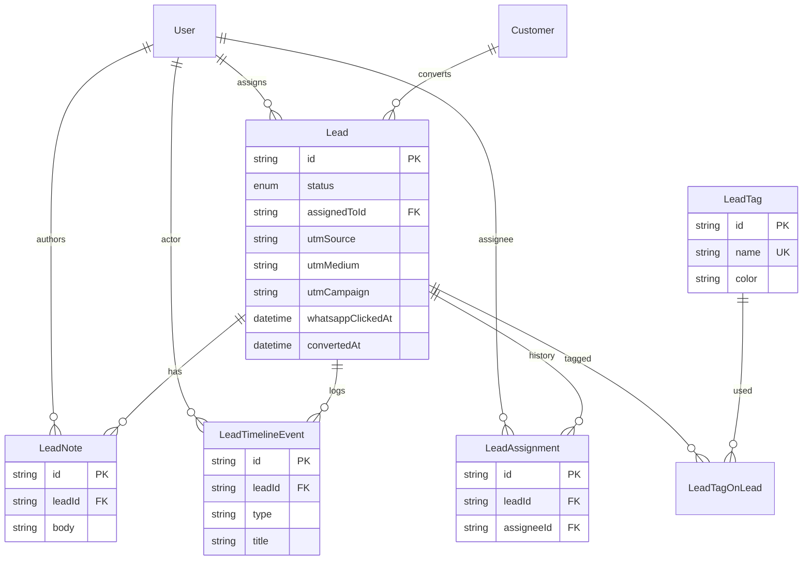

# Sprint 2.1 — CRM Foundation

## Migration plan

1. **Extend `LeadStatus` enum** — add pipeline stages; map legacy values in SQL/script:
   - `qualified` → `interested`
   - `converted` → `paid`
2. **Alter `Lead`** — add `assignedToId`, `utmSource`, `utmMedium`, `utmCampaign`, `convertedAt`, `country`
3. **Create tables** — `LeadNote`, `LeadTag`, `LeadTagOnLead`, `LeadTimelineEvent`, `LeadAssignment`
4. **Extend `User`** — assignment relations
5. **RBAC** — replace `leads:read/write` with `leads:view/create/update/delete` in seed + `rbac.ts`
6. **Run** `npm run db:migrate` then `npm run db:seed`
7. **Reindex** `npm run db:reindex-search`

## ERD changes



## API specification

### Public

**POST `/api/leads/capture`** (rate limited)

Request:
```json
{
  "name": "string",
  "phone": "string",
  "device": "string?",
  "planSlug": "string?",
  "source": "order_modal | whatsapp | trial",
  "utm_source": "string?",
  "utm_medium": "string?",
  "utm_campaign": "string?",
  "whatsappClicked": "boolean?"
}
```

Response: `{ "ok": true, "id": "lead_id" }`

Upserts by phone (latest open lead) or creates new; writes timeline event.

### Admin (RBAC + audit)

| Method | Route | Permission | Body |
|--------|-------|------------|------|
| GET | `/api/admin/leads` | leads:view | query: page, limit, search, status, assignedToId |
| GET | `/api/admin/leads/[id]` | leads:view | — |
| PATCH | `/api/admin/leads/[id]` | leads:update | status, assignedToId, planSlug, device, … |
| POST | `/api/admin/leads/[id]/notes` | leads:update | `{ body }` |
| POST | `/api/admin/leads/[id]/tags` | leads:update | `{ tagName }` or `{ tagId }` |
| DELETE | `/api/admin/leads/[id]` | leads:delete | — |

All mutations append `AuditLog` + `LeadTimelineEvent`.
